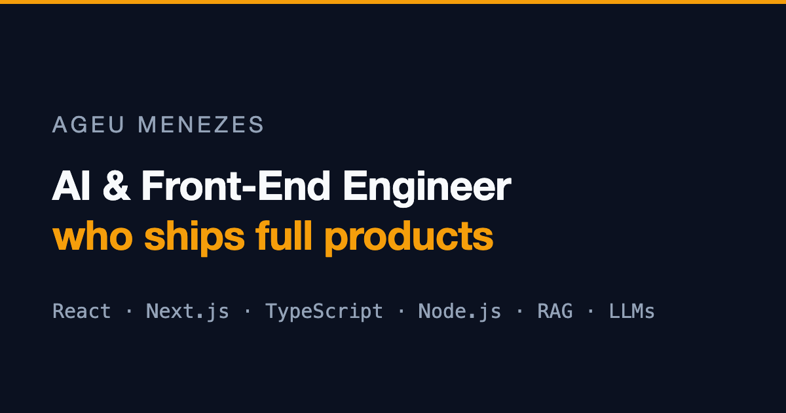

# Ageu Menezes — Developer Portfolio

Bilingual (EN/PT) portfolio of a front-end developer who ships full products.

**Live:** https://ageumenezes-dp-2.vercel.app



## Stack

- **React 18 + Vite + TypeScript** — SPA with code-split sections
- **Tailwind CSS + shadcn/ui + Framer Motion** — custom design system (deep navy + amber, Archivo + JetBrains Mono)
- **react-hook-form + zod** — validated contact form with honeypot
- **Vercel Serverless Function + Resend** — contact form email delivery (`api/contact.ts`)
- **Vercel Analytics** — privacy-friendly page analytics

## Features

- English by default with a Portuguese toggle; theme (dark/light) toggle
- Unified bilingual content layer in `src/data/` (projects, profile, experience, skills, certificates)
- Flagship client case study presented as confidential — no client name, links or real data
- Real project screenshots, optimized WebP images, preloaded LCP hero photo
- SEO: full meta/OG/Twitter tags, sitemap, robots.txt — Lighthouse SEO 100 / a11y 100
- Downloadable one-page resume (`public/resume.pdf`, source in `docs/resume.html`)

## Development

```bash
npm install
npm run dev        # local dev server
npm run dev:remote # dev server over HTTPS via Tailscale (see below)
npm run build      # typecheck + production build
npm run preview    # preview the production build
```

### Testing on a phone (`dev:remote`)

`npm run dev:remote` puts the Vite server behind [`tailscale serve`](https://tailscale.com/kb/1312/serve)
on HTTPS port 8443 and prints a `https://<machine>.<tailnet>.ts.net:8443` URL that works from any
device signed into the same tailnet — including from mobile data. Hot reload works over `wss`.

Requires Tailscale running on both machines and HTTPS certificates enabled for the tailnet. Port 8443
is used so an existing `tailscale serve` mapping on 443 keeps working; the mapping is removed
automatically when the dev server stops.

Both ports can be overridden if something else is already listening:

```bash
PORT=5174 HTTPS_PORT=10000 npm run dev:remote
```

### Contact form (serverless)

The form posts to `api/contact.ts`, which sends email through [Resend](https://resend.com).
Set `RESEND_API_KEY` in the Vercel project settings (see `.env.example`).
To test locally, run `vercel dev` with a `.env` file.

## Project structure

```
api/contact.ts        # Vercel serverless function (Resend email)
src/data/             # bilingual content: projects, profile, experience, skills
src/components/       # sections (Hero, Projects, Experience, About, Skills, Contact)
src/providers/        # theme + language providers
public/certificates/  # course certificate PDFs
docs/resume.html      # resume source (printed to public/resume.pdf)
```
